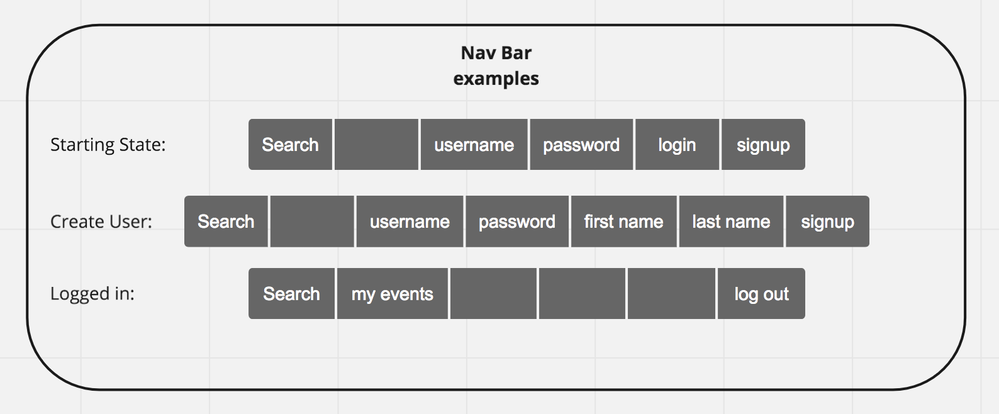
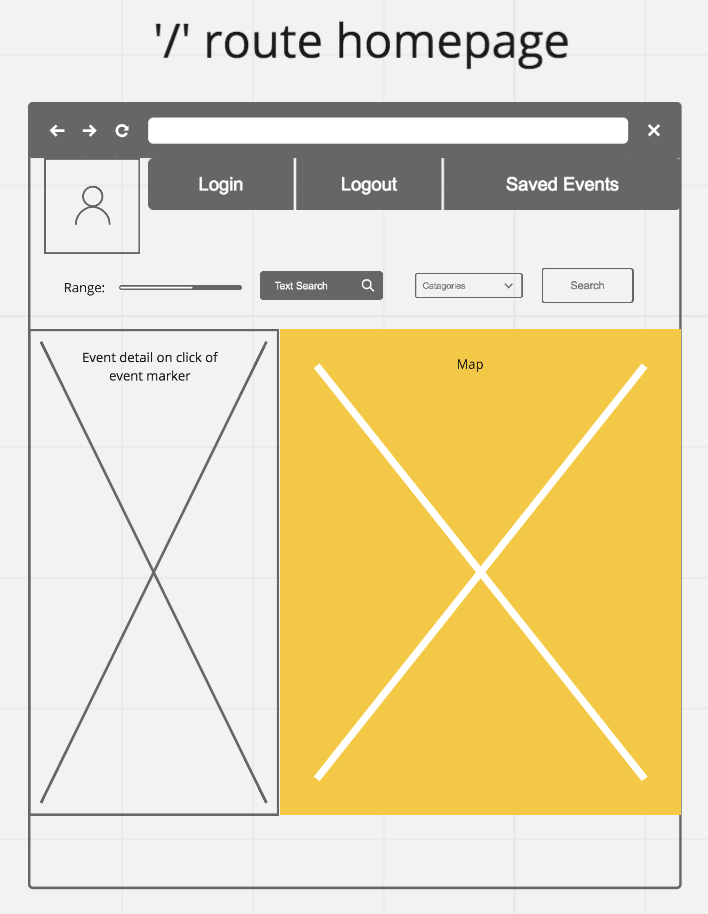
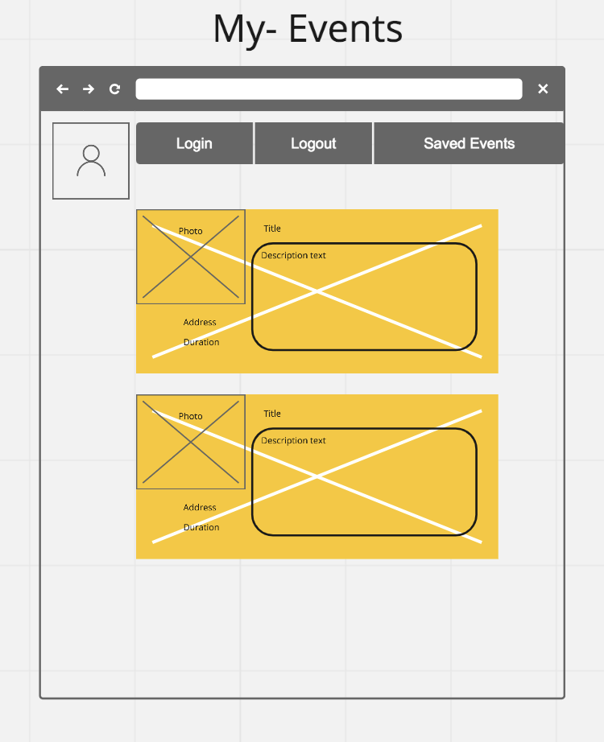
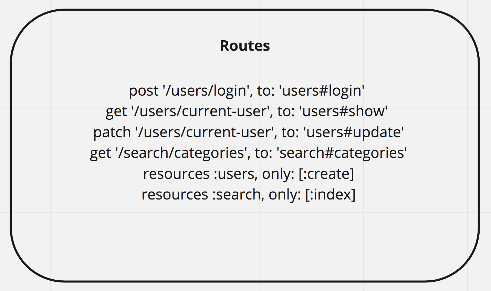
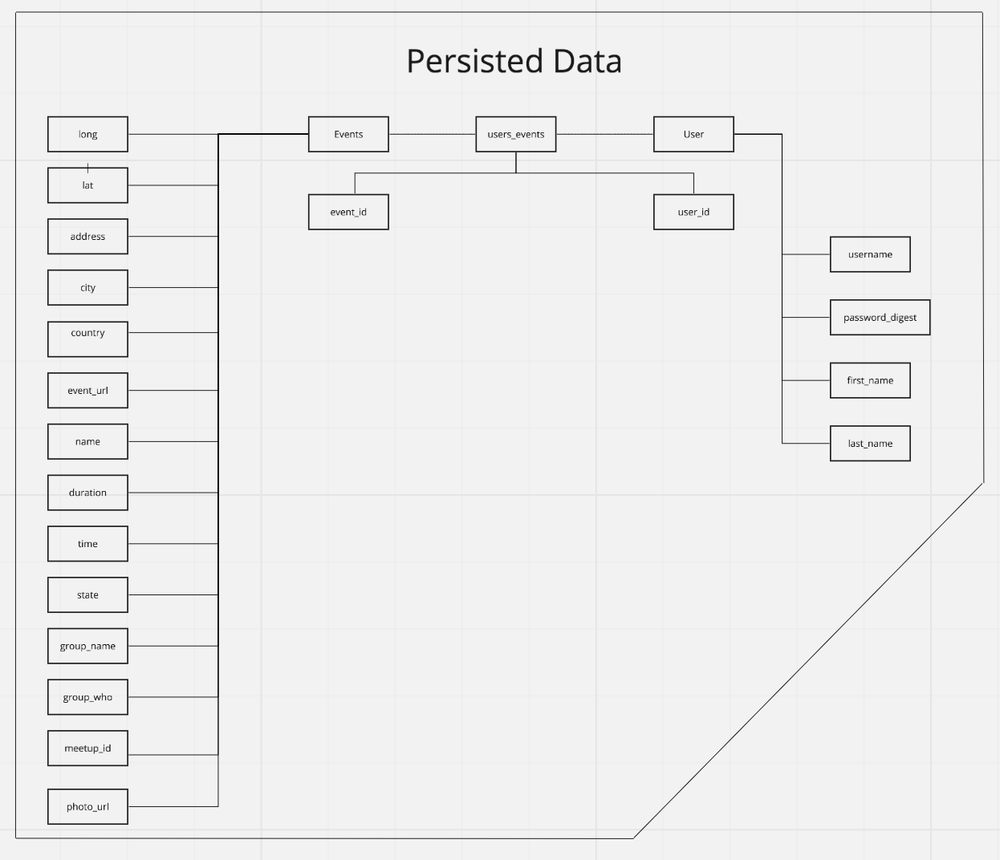
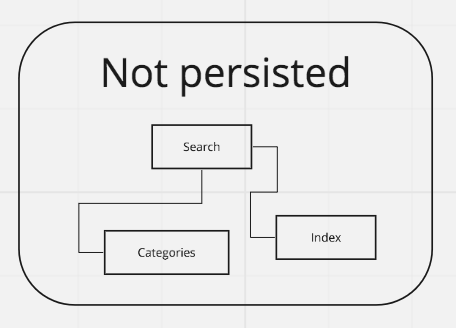

# Concept:

Meet-By-Me is an app where a person can see the meetups near them, view them on a map, and save them to a private list. 

Joint project with <a href="https://github.com/sxkosone">Susanna Kosonen</a>

## As a User I want to:
  * See Meet-Ups within a given distance of my current location on a map
  * Get thier title by mousing over pin
  * Search Meet-Ups by category or key words
  * Save or remove these Meet-Ups in my own private list
  
### Browser troubleshooting
- If you get an "Error: Failed to initialize WebGL." on Google Chrome, you need to change your browser settings. Go to `chrome://flags` on the omnibar and enable WebGL Draft Extensions and Override Software Rendering List. You'll be required to restart the browser after this.

# Wireframes:

# Frame Works and Libraries

### Frontend:

* React
* MapBoxGl
* MeetUp Api
* Semantic-Ui-React

### Backend:

* Rails
* Postgres
* Jwt (Token Auth)
* Figaro (ENV key manager) 

## Model Design:

